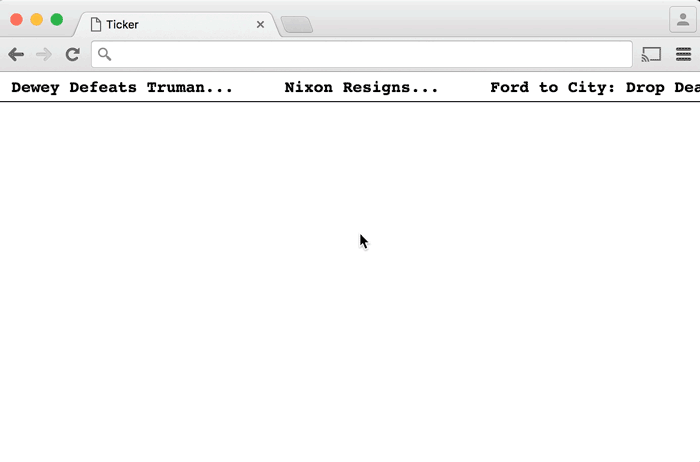

# Node + PostgreSQL + Redis

#Technologies:
  * Javascript
  * Nose JS
  * Redis
  * PostgreSQL
  * HTML
  * CSS
  * Jquery
  * Session-express

# Tasks:
  * create a server and listen on port 8080
  * Create a static HTML page named name.html that contains a form of the user's name and lastName, then submit this form and add it to your PostgreSQL database.
  * set cookies for the entered data to be remembered across the requests.
  * create another HTML page which contains another form contains (color, city, url, age) of the user and store the data in a table.
  * joined the tables from the previous forms.
  * Filter the users displayed by city and favorite color.
  * check Redis to see if you have the rows cached. If you don't have them in the cache you should do the query and then store the rows in Redis.
  * Modify your Twitter API project so that you get the tweets from cache if possible. If they are not in the cache, you should request them from Twitter and cache them for 10 minutes after you get them.

